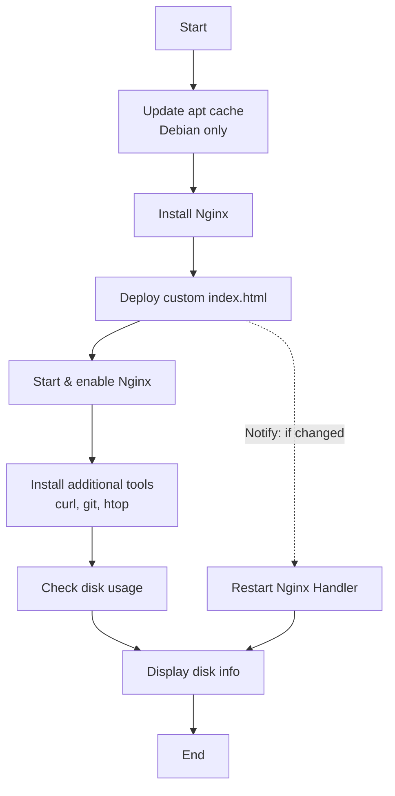

# ansible_intro
Ansible Learning Process for Beginners
# This Readme has been polished by AI
```markdown
# Ansible Capabilities Demonstration Playbook


A simple, well-documented Ansible playbook designed to illustrate fundamental Ansible concepts through a practical example: deploying and configuring an Nginx web server.

---

## 📋 Table of Contents
- [Overview](#overview)
- [Features Demonstrated](#features-demonstrated)
- [Playbook Workflow](#playbook-workflow)
- [Prerequisites](#prerequisites)
- [Installation & Setup](#installation--setup)
- [Usage](#usage)
- [Example Output](#example-output)
- [Playbook Structure Explained](#playbook-structure-explained)
- [Key Ansible Concepts Covered](#key-ansible-concepts-covered)
- [Customization](#customization)
- [Troubleshooting](#troubleshooting)
- [Contributing](#contributing)
- [License](#license)

---

## 🚀 Overview

| **Attribute**       | **Details**                         |
|----------------------|-------------------------------------|
| **Purpose**         | Showcase core Ansible features      |
| **Target Audience** | Ansible beginners / intermediate    |
| **Demo Application**| Nginx web server                    |
| **Supported OS**    | Debian/Ubuntu, RHEL/CentOS (partial)|

This project provides a practical, step-by-step introduction to Ansible automation. By running a single playbook, you will see how Ansible handles package management, service control, file deployment, dynamic templating, conditionals, loops, variable registration, and event-driven handlers.

---

## ✨ Features Demonstrated

- ✅ **Idempotency** – Tasks only make changes when necessary
- ✅ **Multi-OS Package Management** – Generic `package` module works across different Linux families
- ✅ **Privilege Escalation** – Using `become: yes` for system-level operations
- ✅ **Variables** – Centralized configuration values
- ✅ **Jinja2 Templating** – Dynamic content generation with host-specific data
- ✅ **Conditionals** – OS-specific task execution via `when`
- ✅ **Loops** – Installing multiple packages with a single task
- ✅ **Registering Output** – Capturing and displaying command results
- ✅ **Handlers & Notifications** – Triggering service restart only when configuration changes
- ✅ **File Management** – Setting ownership, group, and permissions
- ✅ **Service Management** – Starting and enabling services at boot
- ✅ **Debug Output** – Real-time visibility into playbook execution

---

## 🔄 Playbook Workflow



---

## 📦 Prerequisites

Before running this playbook, ensure you have:

| Requirement              | Minimum Version / Details       |
|---------------------------|---------------------------------|
| **Ansible**               | 2.9 or later                   |
| **Python**                | 3.6+ (on control node)         |
| **Target Host(s)**        | Linux (Debian/Ubuntu tested)   |
| **SSH Access**            | Key-based or password auth     |
| **Sudo Privileges**       | On target host(s)              |
| **Inventory File**        | Host(s) defined in `/etc/ansible/hosts` or a custom file |

### Verify Ansible Installation
```bash
ansible --version
```

### Verify Connectivity to Target Hosts
```bash
ansible all -m ping -i inventory.ini
```

---

## ⚙️ Installation & Setup

### 1. Clone the Repository
```bash
git clone https://github.com/your-username/ansible-demo-playbook.git
cd ansible-demo-playbook
```

### 2. Configure Your Inventory

Create an `inventory.ini` file (or edit the default):
```ini
[webservers]
192.168.1.100 ansible_user=ubuntu
192.168.1.101 ansible_user=debian

[all:vars]
ansible_python_interpreter=/usr/bin/python3
```

> **Note:** Adjust IP addresses and usernames according to your environment.

### 3. Test Connectivity
```bash
ansible all -m ping -i inventory.ini
```

Expected output:
```
192.168.1.100 | SUCCESS => {
    "ansible_facts": {
        "discovered_interpreter_python": "/usr/bin/python3"
    },
    "changed": false,
    "ping": "pong"
}
```

---

## 🎯 Usage

### Basic Execution
Run the playbook with the default inventory:
```bash
ansible-playbook playbook.yml
```

### Execute with Custom Inventory
```bash
ansible-playbook -i inventory.ini playbook.yml
```

### Dry Run (Check Mode)
Preview changes without actually applying them:
```bash
ansible-playbook playbook.yml --check
```

### Increase Verbosity for Debugging
```bash
ansible-playbook playbook.yml -v    # verbose
ansible-playbook playbook.yml -vv   # more verbose
ansible-playbook playbook.yml -vvv  # connection debugging
ansible-playbook playbook.yml -vvvv # full execution details
```

### Limit to Specific Hosts
```bash
ansible-playbook playbook.yml --limit 192.168.1.100
```

### Run with Tags (Optional - if you add tags)
```bash
ansible-playbook playbook.yml --tags "install,configure"
```

---

## 📊 Example Output

```
PLAY [A simple playbook to demonstrate Ansible capabilities] ******************

TASK [Gathering Facts] ********************************************************
ok: [192.168.1.100]

TASK [Update apt cache (for Debian/Ubuntu)] **********************************
changed: [192.168.1.100]

TASK [Install the web server package] *****************************************
ok: [192.168.1.100]

TASK [Create a custom index.html with hostname information] ******************
changed: [192.168.1.100]

TASK [Start and enable the web service] **************************************
ok: [192.168.1.100]

TASK [Install several helpful packages using a loop] *************************
ok: [192.168.1.100] => (item=curl)
ok: [192.168.1.100] => (item=git)
ok: [192.168.1.100] => (item=htop)

TASK [Check disk usage on the root filesystem] *******************************
ok: [192.168.1.100]

TASK [Display disk usage information] ****************************************
ok: [192.168.1.100] => {
    "msg": "Disk usage on /: ['Filesystem      Size  Used Avail Use% Mounted on', '/dev/sda1        20G  4.5G   15G  24% /']"
}

RUNNING HANDLER [restart web service] ****************************************
changed: [192.168.1.100]

PLAY RECAP ********************************************************************
192.168.1.100              : ok=9    changed=3    unreachable=0    failed=0    skipped=0    rescued=0    ignored=0
```

After execution, visit `http://<your-server-ip>` to see the welcome page with the server's hostname.

---

## 🧩 Playbook Structure Explained

```
playbook.yml
│
├── Play Definition
│   ├── name: Description of the play
│   ├── hosts: Target inventory group/all
│   ├── become: Privilege escalation flag
│   └── vars: Centralized variables
│
├── Tasks (executed sequentially)
│   ├── Task 1: Update apt cache (conditional)
│   ├── Task 2: Install web server package
│   ├── Task 3: Deploy custom HTML page (triggers handler)
│   ├── Task 4: Start & enable service
│   ├── Task 5: Install multiple packages (loop)
│   └── Task 6-7: Check and display disk usage
│
└── Handlers (triggered by notifications)
    └── Handler 1: Restart web service
```

---

## 🔑 Key Ansible Concepts Covered

| Concept | Implementation in Playbook |
|---------|----------------------------|
| **Idempotency** | Tasks report `ok` instead of `changed` if state already matches |
| **Variables** | `web_package`, `web_service`, `html_path` |
| **Facts** | `ansible_os_family`, `ansible_hostname` |
| **Templates/Jinja2** | `{{ ansible_hostname }}` in HTML content |
| **Conditionals** | `when: ansible_os_family == "Debian"` |
| **Loops** | `loop: [curl, git, htop]` |
| **Registration** | `register: disk_usage` |
| **Handlers** | `notify: restart web service` |
| **Modules** | `package`, `copy`, `service`, `command`, `debug`, `apt` |

---

## 🛠 Customization

### Change the Web Server
```yaml
vars:
  web_package: apache2
  web_service: apache2
  html_path: /var/www/html/index.html
```

### Add More Packages
```yaml
loop:
  - curl
  - git
  - htop
  - vim
  - tree
  - net-tools
```

### Modify the Welcome Page
Change the `content` field in Task 3 to include custom HTML, CSS, or additional Jinja2 expressions.

### Extend OS Support
Add tasks for RHEL/CentOS:
```yaml
- name: Update yum cache (for RHEL/CentOS)
  ansible.builtin.yum:
    update_cache: yes
  when: ansible_os_family == "RedHat"
```

---

## 🔧 Troubleshooting

| Issue | Possible Solution |
|-------|-------------------|
| **Connection timeout** | Check SSH keys, user permissions, and firewall settings |
| **`sudo: no tty present`** | Ensure NOPASSWD is configured in sudoers or use `--ask-become-pass` |
| **`Module not found`** | Verify Ansible version (`≥2.9`) and Python interpreter path |
| **`Permission denied`** | Confirm `become: yes` is set and user has sudo privileges |
| **Package installation fails** | Check network connectivity and repository configuration |
| **`apt cache` update fails** | Verify `apt-get update` works manually on the target |

### Common Debugging Commands
```bash
# Gather facts about a host
ansible <hostname> -m setup

# Test a specific module
ansible <hostname> -m apt -a "update_cache=yes" --become

# Check syntax of playbook
ansible-playbook playbook.yml --syntax-check

# List hosts that would be targeted
ansible-playbook playbook.yml --list-hosts
```

---

## 🤝 Contributing

Contributions are welcome! Here's how you can help:

1. **Fork the repository**
2. **Create a feature branch**: `git checkout -b feature/new-concept`
3. **Add your improvement** (more modules, OS support, handlers, etc.)
4. **Commit changes**: `git commit -m "Add: new Ansible concept demo"`
5. **Push to branch**: `git push origin feature/new-concept`
6. **Open a Pull Request**

### Guidelines
- Maintain clear, line-by-line English comments in YAML
- Update README if you add significant features
- Test on at least one Linux distribution before submitting

---

## 📄 License

This project is licensed under the MIT License – see the [LICENSE](LICENSE) file for details.

```
MIT License

Copyright (c) 2025 [Your Name/Organization]

Permission is hereby granted, free of charge, to any person obtaining a copy
of this software and associated documentation files...
```

---

## 🌟 Support & Acknowledgements

- **Official Ansible Documentation**: [docs.ansible.com](https://docs.ansible.com/)
- **Ansible Galaxy**: [galaxy.ansible.com](https://galaxy.ansible.com/)
- **Community**: [Ansible Forum](https://forum.ansible.com/)

---

<div align="center">
⭐ If this project helped you understand Ansible, please give it a star!
<br/>
<a href="https://github.com/your-username/ansible-demo-playbook">GitHub Repository</a> • 
<a href="https://github.com/your-username/ansible-demo-playbook/issues">Report Issue</a>
</div>
```

---
